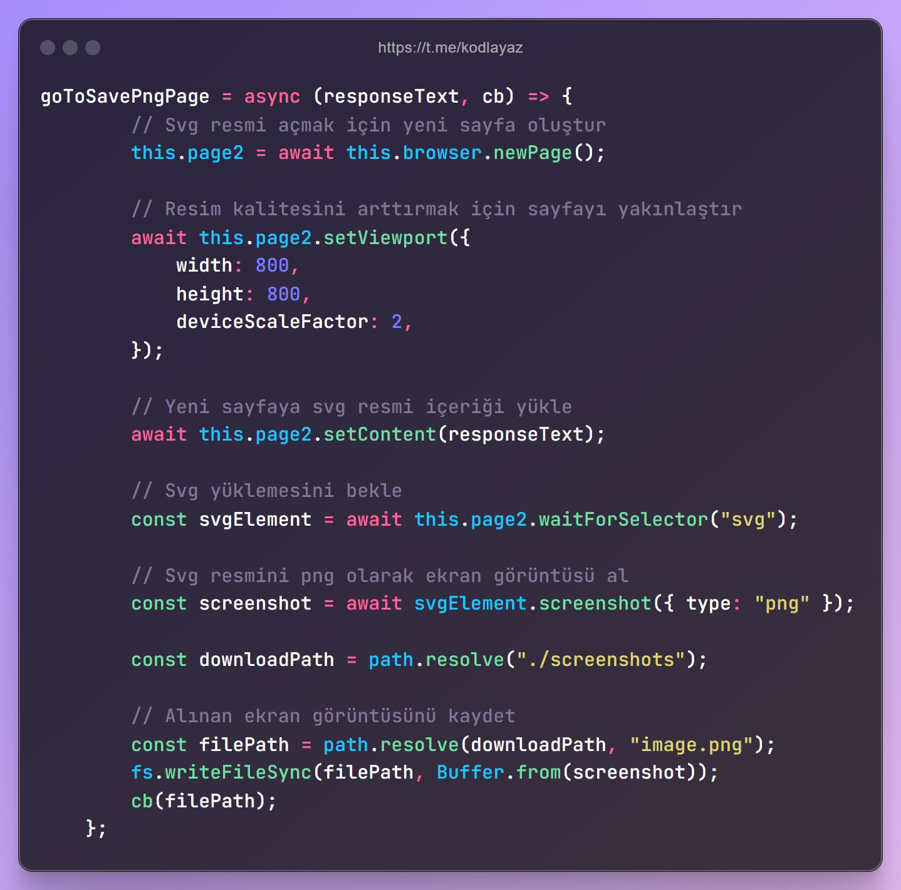

# Telegram Kodu Resme Dönüştüren Bot

## Nasıl Çalışır?
Puppeteer kullanarak Ray.so isimli resim üretici sitesine ulaşır ve kodunuzun çıktısını svg olarak üretir. Tarayıcı üzerinde svg çıktısını png uzantısına çevirir ve telegram üzerinden iletir.

Kullanıcının `/kod` veya `/code` komutuyla kodunu iletmesi yeterlidir.

